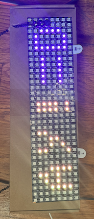
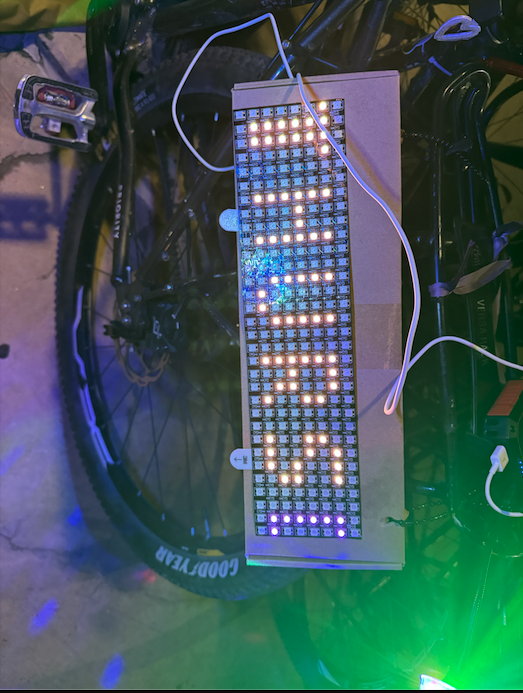
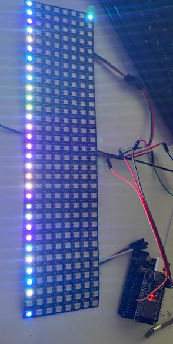
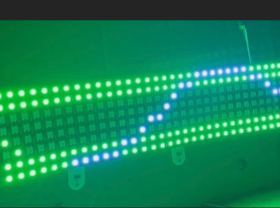
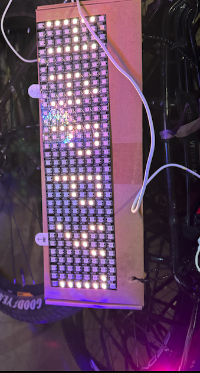
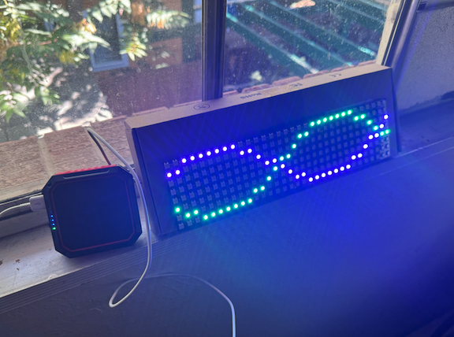
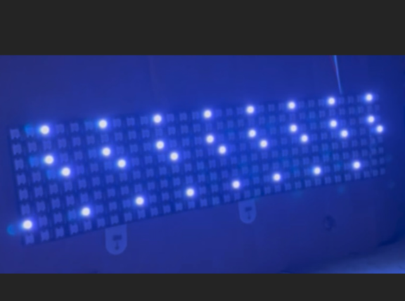
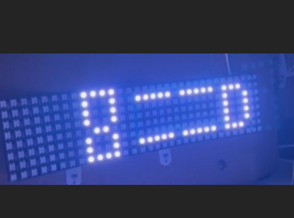

# Happy Thursday LED 2D WS2812 ESP32

This project powers a 256 individually addressable 2D LED board wrapped in a snake-like matrix using an ESP32. The project features 3 or 4 distinct animations written in C++, with one of the animations being ASCII art, where rows and columns of ASCII characters are translated into 4x6 bit LED pixels on the board, which is indexed from 0 to 255.

## Features

- **Individually Addressable LEDs**: Control 256 WS2812 LEDs in a 2D matrix.
- **Snake-like Matrix Layout**: The LED board is wrapped in a snake pattern for unique display.
- **Custom Animations**: 3-4 C++ animations, including:
  - **ASCII Art Animation**: Converts 4x6 pixel ASCII characters into LED displays.

## Requirements

To run this project, you must install the following:

- **Espressif IDE**: This project runs on the ESP32 microcontroller, and Espressif's IDE is required for building and uploading the code.
  
## Getting Started

1. Clone the repository:
    ```bash
    git clone https://github.com/your-username/happy-thursday-led-2d-ws2812-esp32.git
    ```

2. Open the project in Espressif IDE.

3. Compile and upload the code to your ESP32.

Once uploaded, the project should run fine, and the LED animations will start on your 256 LED matrix.

## Photo Gallery

|  |  |  |
|:------------------------------:|:------------------------------:|:------------------------------:|
|  |  |  |
|  |                                |  |


## Attachments
## Attachments

Make sure to refer to the attached PDF file, [**8x32 2812 c project.pdf**](8x32%202812%20c%20project.pdf), for additional documentation and details on the implementation.

## License

This project is licensed under the MIT License - see the [LICENSE](LICENSE) file for details.
